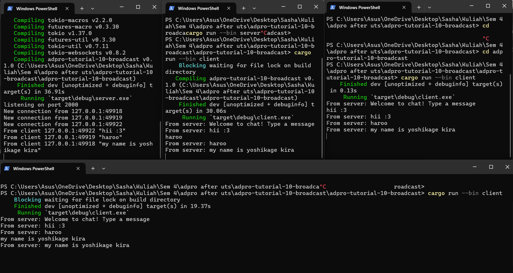

## Experiment 2.1: Original code, and how it run

Dengan menjalankan server dan client, maka client akan terhubung dengan server dan ketika client mengirimkan pesan, maka client yang terhubung dengan server tersebut akan menerima pesan dari client yang mengirim pesan tersebut.