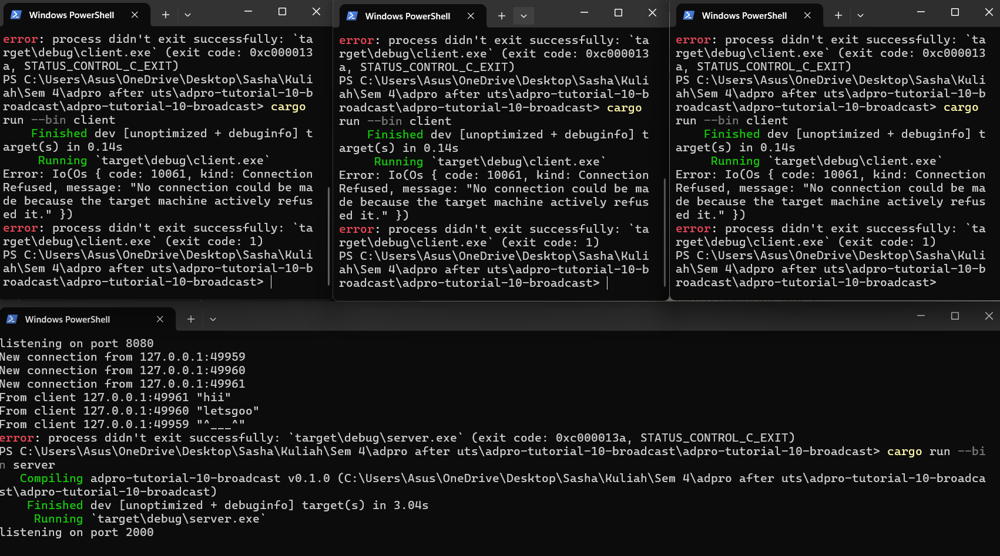
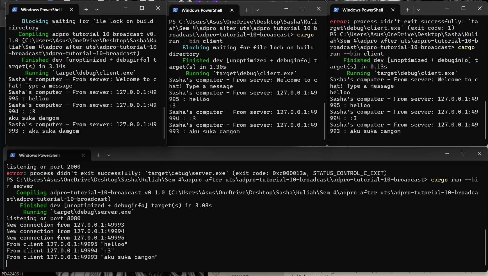

## Experiment 2.1: Original code, and how it run

Dengan menjalankan server dan client, maka client akan terhubung dengan server dan ketika client mengirimkan pesan, maka client yang terhubung dengan server tersebut akan menerima pesan dari client yang mengirim pesan tersebut.

## Experiment 2.2: Modifying port
Port sama:

Port berbeda:

Dengan hal ini, dapat dilihat bahwa jika port antara server dan client berbeda, maka client tidak dapat terhubung ke server sehingga akan menghasilkan error seperti gambar di atas

## Experiment 2.3: Modifying port

Dapat dilihat bahwa perubahan pada format bcast_tx.send dalam file server.rs akan memunculkan pesan seperti foto di atas. Selain itu, perubahan println pada client.rs akan membuat pesan broadcast yang diterima client berubah seperti pada gambar.

